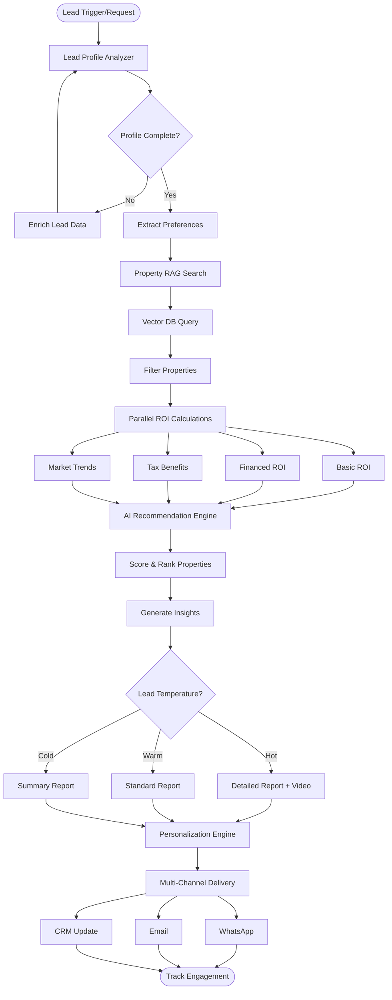
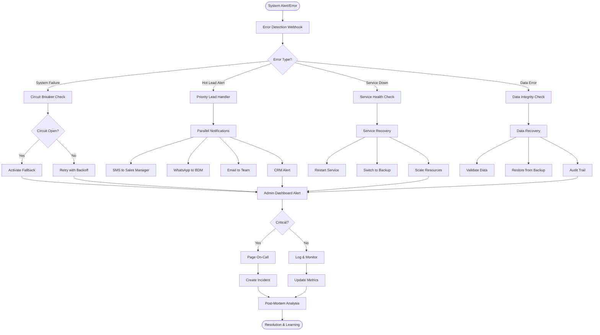

# Workflow

## 1. Lead Intelligence & Scoring Workflow

Visual Diagram Representation
```
┌─────────────┐
│  Webhook    │
│  New Lead   │
│     ⚡      │
└──────┬──────┘
       │
       ▼
┌─────────────┐     ┌─────────────┐
│ Data Valid? │───▶│ Send Error  │
│   Router    │ No  │ Notification│
└──────┬──────┘     └─────────────┘
       │ Yes
       ▼
┌─────────────┐     ┌─────────────┐
│Lead Enrichm.│────▶│External APIs│
│   Agent     │     │ (Parallel)  │
└──────┬──────┘     └─────────────┘
       │                    │
       ▼                    │
┌─────────────┐             │
│ AI Scoring  │◀────────────┘
│Agent (GPT-4)│
└──────┬──────┘
       │
       ▼
┌─────────────┐
│Score Router │
│   (Hot/     │
│ Warm/Cold)  │
└──┬───┬───┬──┘
   │   │   │
   ▼   ▼   ▼
┌───┐┌───┐┌───┐
│Hot││Wrm││Cld│
│WA ││Eml││Eml│
└───┘└───┘└───┘
```

Implementation Notes:
- Webhook Security: Add authentication token validation
- Error Handling: Implement try-catch blocks in code nodes
- Parallel Processing: Use split-in-batches for bulk leads
- Rate Limiting: Add delays between API calls
- Monitoring: Track scoring accuracy and conversion rates
- Would you like me to continue with the next workflow (Multi-Channel Content Distribution)?

## 2. Multi-Channel Content Distribution Workflow
Visual Diagram Representation

```
┌─────────────┐
│  Campaign   │
│ Trigger API │
│     ⚡      │
└──────┬──────┘
       │
       ▼
┌─────────────┐     ┌─────────────┐
│Content Type │────▶│ Validation  │
│  Router     │ No  │   Error     │
└──────┬──────┘     └─────────────┘
       │ Yes
       ▼
┌─────────────┐     ┌─────────────┐     ┌─────────────┐
│ AI Content  │────▶│ DALL-E 3   │────▶│ Stable      │
│ Generator   │     │ Image Gen   │     │ Video Gen   │
│  (GPT-4)    │     └─────────────┘     └─────────────┘
└──────┬──────┘                                │
       │                                       │
       ▼                                       │
┌─────────────┐     ┌──────────────────────────┘
│ A/B Testing │     │
│   Router    │     │
└──┬───┬───┬──┘     │
   │   │   │        │
   ▼   ▼   ▼        ▼
┌───────────────────────────────────────────┐
│         Parallel Distribution             │
├───┬─────┬─────┬─────┬─────┬─────┬─────┬───┤
│FB │ IG  │ LI  │ WA  │ YT  │ TT  │ SMS │EML│
└───┴─────┴─────┴─────┴─────┴─────┴─────┴───┘
   │   │     │     │     │     │     │     │
   ▼   ▼     ▼     ▼     ▼     ▼     ▼     ▼
┌─────────────────────────────────────────────┐
│        Performance Tracking Loop            │
│   ┌─────┐ ┌─────┐ ┌─────┐ ┌─────┐           │
│   │CTR  │ │Conv │ │Eng  │ │Reach│           │
│   └─────┘ └─────┘ └─────┘ └─────┘           │
└─────────────────────────────────────────────┘
```
## 3. Lead Nurture Sequence with Human-in-Loop
Visual Diagram Representation
```
┌─────────────┐
│Lead Trigger │
│Temperature  │
│ Detection   │
└──────┬──────┘
       │
       ▼
┌─────────────┐     ┌─────────────┐
│Temperature  │────▶│    Cold     │
│   Router    │     │Lead Queue   │
└──┬───┬───┬──┘     └─────────────┘
   │   │   │
Hot│Wrm│Cold
   ▼   ▼   ▼
┌─────────────┐     ┌─────────────┐
│Value Check  │     │ Standard    │
│≥ ₹2Cr?      │ No  │ Nurture     │
└──────┬──────┘     │ Sequence    │
       │Yes         └─────────────┘
       ▼
┌─────────────┐     ┌─────────────┐
│ Slack Alert │────▶│   Human     │
│High-Value   │     │ Approval    │
│Lead Review  │     │  Gateway    │
└─────────────┘     └──────┬──────┘
                           │
                    ┌──────┴──────┐
              Approve│            │Reject
                    ▼             ▼
              ┌─────────────┐ ┌─────────────┐
              │ Premium     │ │ Standard    │
              │ Sequence    │ │ Sequence    │
              └─────────────┘ └─────────────┘
                     │             │
                     ▼             ▼
              ┌─────────────────────────────┐
              │     Sequential Follow-up    │
              │  Day 1 → Day 3 → Day 7 →    │
              │  Day 14 → Day 30            │
              └─────────────────────────────┘
                           │
                           ▼
              ┌─────────────────────────────┐
              │    Engagement Tracking      │
              │  📊 Opens │ 👆 Clicks │    │
              │  💬 Replies │ 📞 Calls     │
              └─────────────────────────────┘
```

Implementation Notes:
- Multi-Channel Content Distribution:
- Parallel Processing: All platforms receive content simultaneously
- AI-Generated Media: DALL-E 3 + Stable Diffusion for diverse visuals
- Performance Tracking: Real-time metrics collection every hour
- A/B Testing: Automatic variant generation and testing
- Lead Nurture with Human-in-Loop:
- Value Threshold: ₹2Cr+ leads trigger human review
- Approval Gateway: Slack integration for quick decisions
- Sequential Delivery: Time-delayed message sequences
- Engagement Monitoring: Real-time tracking with sales alerts
- Multi-Channel: WhatsApp, Email, SMS based on preferences
- Both workflows include comprehensive error handling, logging, and performance optimization features from the main FineAcers system.

## 4. Campaign Optimization Feedback Loop
Visual Diagram Representation
```

┌─────────────┐
│  Campaign   │
│   Launch    │
│   Trigger   │
└──────┬──────┘
       │
       ▼
┌─────────────────────────────────────┐
│    Performance Monitoring Agent     │
│ ┌─────┐ ┌─────┐ ┌─────┐ ┌─────┐     │
│ │CTR  │ │Conv │ │ROI  │ │Eng  │     │
│ └─────┘ └─────┘ └─────┘ └─────┘     │
└─────────────┬───────────────────────┘
               │ 15min intervals
               ▼
┌─────────────────────────────────────┐
│      Analytics Aggregation          │
│  ┌────────────────┐                 │
│  │Platform Metrics│                 │
│  ├────────────────┤                 │
│  │ FB │IG │LI│WA  │                 │
│  └────────────────┘                 │
└─────────────┬───────────────────────┘
               │
               ▼
┌─────────────┐     ┌─────────────┐
│Performance  │ No  │  Continue   │
│Threshold?   │────▶│ Monitoring  │
└──────┬──────┘     └─────────────┘
       │ Yes
       ▼
┌─────────────────────────────────────┐
│       AI Optimization Agent         │
│  ┌─────────────┐ ┌─────────────┐    │
│  │GPT-4 Analyze│ │ML Prediction│    │
│  └─────────────┘ └─────────────┘    │
└─────────────┬───────────────────────┘
               │
               ▼
┌─────────────┐     ┌─────────────┐
│Confidence   │ Low │   Human     │
│Score > 80%? │────▶│  Review     │
└──────┬──────┘     └─────────────┘
       │ High
       ▼
┌─────────────────────────────────────┐
│        Optimization Router          │
├─────┬─────┬─────┬─────┬─────────────┤
│Copy │Time │Aud  │Bid  │Creative     │
└──┬──┴──┬──┴──┬──┴──┬──┴────┬────────┘
   │     │     │     │       │
   ▼     ▼     ▼     ▼       ▼
┌─────────────────────────────────────┐
│         A/B Test Creation           │
│  ┌─────┐ ┌─────┐ ┌─────┐            │
│  │Var A│ │Var B│ │Ctrl │            │
│  └─────┘ └─────┘ └─────┘            │
└─────────────┬───────────────────────┘
               │
               ▼
┌─────────────────────────────────────┐
│    Automatic Campaign Adjustment    │
│  • Update Content                   │
│  • Shift Budget                     │
│  • Change Timing                    │
│  • Modify Targeting                 │
└─────────────┬───────────────────────┘
               │
               ▼
┌─────────────┐     ┌─────────────┐
│  Rollback   │────▶│Performance  │
│  Safety     │ No  │ Improved?   │
└─────────────┘     └──────┬──────┘
                           │ Yes
                           ▼
                    ┌─────────────┐
                    │   Apply &   │
                    │   Learn     │
                    └─────────────┘
```

## 5. Conversational AI Sales Agent Hierarchy
Visual Diagram Representation
```
┌─────────────┐
│  Customer   │
│  Message    │
│   Input     │
└──────┬──────┘
       │
       ▼
┌─────────────────────────────────────┐
│    Primary Conversation Agent       │
│  ┌─────────────┐ ┌─────────────┐    │
│  │Context Load │ │Lead Profile │    │
│  └─────────────┘ └─────────────┘    │
└─────────────┬───────────────────────┘
               │
               ▼
┌─────────────────────────────────────┐
│      Intent Detection Router        │
│  ┌─────┐ ┌─────┐ ┌─────┐ ┌─────┐    │
│  │Price│ │Prop │ │Book │ │Gen  │    │
│  └─────┘ └─────┘ └─────┘ └─────┘    │
└──┬────┬────┬────┬───────────────────┘
   │    │    │    │
   ▼    ▼    ▼    ▼
┌────────────────────────────────────┐
│      Specialized Agent Layer       │
├────────┬────────┬────────┬─────────┤
│Pricing │Property│Schedule│ General │
│Expert  │Info Bot│Assistant│Support │
└────┬───┴───┬────┴───┬────┴────┬────┘
     │       │        │         │
     ▼       ▼        ▼         ▼
┌────────────────────────────────────┐
│    Confidence & Escalation Check   │
│  ┌──────────────┐┌─────────────┐   │
│  │Confidence<70%││Complex Query│   │
│  └──────┬───────┘└──────┬──────┘   │
└─────────┼───────────────┼──────────┘
          ▼               ▼
┌─────────────────────────────────────┐
│      Human Handoff Trigger          │
│  ┌─────────────┐ ┌─────────────┐    │
│  │Sales Alert  │ │Queue Position│   │
│  └─────────────┘ └─────────────┘    │
└──────────────┬──────────────────────┘
               │
               ▼
┌─────────────────────────────────────┐
│         CRM Integration             │
│  ┌─────┐ ┌─────┐ ┌─────┐ ┌─────┐    │
│  │Log  │ │Lead │ │Task │ │Alert│    │
│  │Conv │ │Update││Create││Team │    │
│  └─────┘ └─────┘ └─────┘ └─────┘    │
└─────────────────────────────────────┘
               │
               ▼
┌─────────────┐     ┌─────────────┐
│  Response   │────▶│ Performance │
│  Delivery   │     │  Analytics  │
└─────────────┘     └─────────────┘
```
Implementation Notes:
- Campaign Optimization Feedback Loop:
- Continuous Monitoring: 15-minute intervals for real-time performance tracking
- Multi-Metric Analysis: CTR, Conversion Rate, ROI, Engagement tracked simultaneously
- AI + ML Hybrid: GPT-4 for recommendations + ML for performance prediction
- Automatic Rollback: Safety mechanism if performance degrades
- Learning Loop: All results feed back to improve future predictions
- Conversational AI Sales Agent Hierarchy:
- Multi-Tier Architecture: Primary agent → Intent routing → Specialized agents
- Context Preservation: Redis for conversation state management
- Confidence-Based Escalation: Automatic human handoff when confidence < 70%
- CRM Integration: Real-time lead updates and task creation
- Performance Analytics: Every interaction tracked for continuous improvement
- Specialized Expertise: Dedicated agents for pricing, property info, and scheduling

Both workflows include comprehensive error handling, performance tracking, and integration with the FineAcers ecosystem.

## 1. ROI Calculation & Property Matching Workflow
Visual Diagram




## 2. Emergency Response & Escalation Workflow
Visual Diagram


## 8. Cross-Regional Data Sync Workflow
Visual Diagram Representation
```
┌─────────────────┐
│   Schedule      │
│   Trigger       │
│  (Every 5 min)  │
└────────┬────────┘
         │
         ▼
┌─────────────────┐
│  Get Regional   │
│  Configurations │
└────────┬────────┘
         │
         ▼
┌─────────────────┐
│ Fetch Changed   │
│  Data Queue     │
└────────┬────────┘
         │
         ▼
┌─────────────────┐     ┌──────────────┐
│  Compliance     │────▶│ Region Rules │
│  Check Agent    │     │   Database   │
└────────┬────────┘     └──────────────┘
         │
         ▼
┌─────────────────┐
│ Data Transform  │
│   & Masking     │
└────────┬────────┘
         │
         ▼
┌─────────────────┐
│Regional Router  │
│   (Split by     │
│    Region)      │
└──┬──┬──┬──┬────┘
   │  │  │  │
   ▼  ▼  ▼  ▼
┌───┐┌───┐┌───┐┌───┐
│UAE││IND││USA││EUR│
│Syn││Syn││Syn││Syn│
└─┬─┘└─┬─┘└─┬─┘└─┬─┘
  │    │    │    │
  └────┴────┴────┘
         │
         ▼
┌─────────────────┐
│Conflict Handler │
│   (AI Agent)    │
└────────┬────────┘
         │
         ▼
┌─────────────────┐
│  Sync Results   │
│  Aggregator     │
└────────┬────────┘
         │
         ▼
┌─────────────────┐
│  Audit Logger   │
│  & Monitoring   │
└─────────────────┘
```
Implementation Notes:
- Authentication & Security: 
- Each regional endpoint uses OAuth2 with region-specific credentials
- Data is encrypted in transit using TLS 1.3
- Implement API key rotation every 30 days
- Compliance Features: 
- GDPR compliance for EUR region with consent tracking
- Data residency enforcement (data doesn't leave region)
- PII masking based on regional laws
- Audit trail for all sync operations
- Performance Optimization: 
- Batch processing up to 1000 records per sync
- Parallel execution for different regions
- Connection pooling for database queries
- Redis caching for frequently accessed config
- Error Handling: 
- Retry mechanism with exponential backoff
- Dead letter queue for failed syncs
- Circuit breaker pattern for regional endpoints
- Detailed error logging with correlation IDs
- Monitoring & Alerts: 
- Real-time Slack notifications for failures
- Prometheus metrics for sync performance
- Grafana dashboards for regional health
- SLA monitoring (99.9% uptime target)
- Conflict Resolution Strategies: 
- Last-write-wins with timestamp comparison
- Regional priority (home region wins)
- Manual review queue for critical conflicts
- Version control with change history

# priority features in the same budget, so we can award the project immediately:
- Consent & Deliverability Guardrails – Automatic opt-in/opt-out sync across WhatsApp/Email/SMS, frequency caps, quiet hours, and domain health setup (SPF/DKIM/DMARC).
- Attribution to Revenue – Track the full journey from first click → meeting → booking/contract, and push revenue data back into the optimizer so the system learns what really converts.
- Send-Time & Channel Optimization – Learn per-lead “best channel + best hour” to improve engagement (initially rule-based).
- AI Content Guardrails – Central brand voice, banned phrases list, legal disclaimers, and automatic fact/URL checks before posting.
- Cost Controls for AI & APIs – Per-workspace budget tracking, alerts, and fallback logic to cheaper models when usage spikes.
These are the highest-impact, low-overhead additions that will make the platform stronger from Day 1 without major extra development time.


# FINEACERS AI MARKETING AUTOMATION - COMPLETE TECHNICAL MANUAL

**TABLE OF CONTENTS**


- System Architecture
- Technology Stack
- Server Requirements
- Development Environment Setup
- Database Schema
- Core Backend Development
- N8N Workflow Implementation
- API Integrations
- Frontend Development
- Mobile App Development
- Deployment Guide
- Security Implementation
- Testing & QA
- Monitoring & Maintenance

## 1. SYSTEM ARCHITECTURE {#system-architecture}
```
┌─────────────────────────────────────────────────────────────────────────┐
│                          LOAD BALANCER (Nginx)                          │
└────────────────────┬────────────────────────┬───────────────────────────┘
                     │                        │
        ┌────────────▼──────────┐  ┌──────────▼───────────┐
        │   FRONTEND SERVER     │  │    API GATEWAY       │
        │   (Next.js/React)     │  │   (Express.js)       │
        └───────────────────────┘  └──────────┬───────────┘
                                              │
                ┌─────────────────────────────┼─────────────────────────┐
                │                             │                         │
    ┌───────────▼──────────┐     ┌────────────▼─────────┐  ┌────────────▼───────┐
    │   N8N SERVER         │     │  BACKEND SERVICES    │  │  AI SERVICE        │
    │  (Workflow Engine)   │     │  (Node.js/FastAPI)   │  │  (Python/FastAPI)  │
    └──────────┬───────────┘     └───────────┬──────────┘  └────────────┬───────┘
               │                             │                          │
    ┌──────────▼─────────────────────────────▼──────────────────────────▼────────┐
    │                        POSTGRESQL DATABASE                                 │
    │                          + REDIS CACHE                                     │
    └────────────────────────────────────────────────────────────────────────────┘
                                         │
    ┌────────────────────────────────────┼───────────────────────────────────────┐
    │                              MESSAGE QUEUE                                 │
    │                            (RabbitMQ/Kafka)                                │
    └────────────────────────────────────────────────────────────────────────────┘
```


## 2. TECHNOLOGY STACK {#technology-stack}

### BACKEND
        Primary Language: Node.js (v18+)
        Framework: Express.js
        Secondary Language: Python 3.10+ (for AI services)
        Framework: FastAPI

### Database:

        
        PostgreSQL 14+ (main database)
        
        Redis 7+ (caching & sessions)
        
        MongoDB (optional, for logs)

        Message Queue: RabbitMQ or Apache Kafka

        Search Engine: ElasticSearch (optional)

### FRONTEND

        Framework: Next.js 14+

        UI Library: React 18+

        CSS: Tailwind CSS

        State Management: Redux Toolkit

        Charts: Recharts / Chart.js

        Forms: React Hook Form

### MOBILE

        Framework: React Native

        State Management: Redux Toolkit

        Navigation: React Navigation

        Push Notifications: Firebase

### AUTOMATION

        Workflow Engine: N8N (self-hosted)

        Cron Jobs: Node-cron

        Queue Processing: Bull

### AI/ML

        LLM APIs: OpenAI, Claude

        Local Models: Llama 2 (via Ollama)

        ML Framework: TensorFlow.js

        NLP: spaCy

### INFRASTRUCTURE

        Containerization: Docker

        Orchestration: Docker Compose (dev) / Kubernetes (prod)

        CI/CD: GitLab CI / GitHub Actions

        Monitoring: Prometheus + Grafana

        Logging: ELK Stack

## 3. SERVER REQUIREMENTS {#server-requirements}
DEVELOPMENT ENVIRONMENT
Minimum:
  - CPU: 4 cores
  - RAM: 8GB
  - Storage: 50GB SSD
  - OS: Ubuntu 22.04 LTS

Recommended:
  - CPU: 8 cores
  - RAM: 16GB
  - Storage: 100GB SSD
  - OS: Ubuntu 22.04 LTS
PRODUCTION ENVIRONMENT
Web Servers (2x):
  - CPU: 4 cores
  - RAM: 8GB
  - Storage: 50GB SSD

Database Server:
  - CPU: 8 cores
  - RAM: 32GB
  - Storage: 500GB SSD

N8N Server:
  - CPU: 4 cores
  - RAM: 16GB
  - Storage: 100GB SSD

Load Balancer:
  - CPU: 2 cores
  - RAM: 4GB
  - Storage: 20GB SSD


## 4. DEVELOPMENT ENVIRONMENT SETUP {#development-environment}

- STEP 1: Install Prerequisites
```
# Update system
sudo apt update && sudo apt upgrade -y

# Install Node.js
curl -fsSL https://deb.nodesource.com/setup_18.x | sudo -E bash -
sudo apt-get install -y nodejs

# Install Python
sudo apt install python3.10 python3.10-venv python3-pip -y

# Install PostgreSQL
sudo apt install postgresql postgresql-contrib -y

# Install Redis
sudo apt install redis-server -y

# Install Docker
curl -fsSL https://get.docker.com -o get-docker.sh
sudo sh get-docker.sh

# Install Docker Compose
sudo curl -L "https://github.com/docker/compose/releases/download/v2.20.0/docker-compose-$(uname -s)-$(uname -m)" -o /usr/local/bin/docker-compose
sudo chmod +x /usr/local/bin/docker-compose

# Install Git
sudo apt install git -y

# Install Nginx
sudo apt install nginx -y
```

- STEP 2: Project Structure
```
mkdir fineacers-automation
cd fineacers-automation

# Create project structure
mkdir -p {backend,frontend,mobile,n8n-workflows,ai-service,database,docker,docs}
mkdir -p backend/{src,tests,config}
mkdir -p frontend/{src,public,components}
mkdir -p ai-service/{src,models,utils}

# Initialize Git
git init
echo "node_modules/
.env
.DS_Store
dist/
build/
*.log" > .gitignore
```
- STEP 3: Environment Configuration
```
# Create .env files
cat > .env.development << EOL
# Database
DB_HOST=localhost
DB_PORT=5432
DB_NAME=fineacers_dev
DB_USER=fineacers
DB_PASSWORD=secure_password

# Redis
REDIS_HOST=localhost
REDIS_PORT=6379
REDIS_PASSWORD=

# JWT
JWT_SECRET=your-super-secret-jwt-key
JWT_EXPIRY=7d

# APIs
OPENAI_API_KEY=your-openai-key
CLAUDE_API_KEY=your-claude-key

# Email
SMTP_HOST=smtp.gmail.com
SMTP_PORT=587
SMTP_USER=your-email@gmail.com
SMTP_PASS=your-app-password

# WhatsApp
WHATSAPP_API_URL=https://api.whatsapp.com
WHATSAPP_TOKEN=your-whatsapp-token

# Social Media
FACEBOOK_APP_ID=your-fb-app-id
FACEBOOK_APP_SECRET=your-fb-secret
INSTAGRAM_ACCESS_TOKEN=your-insta-token
LINKEDIN_CLIENT_ID=your-linkedin-id
LINKEDIN_CLIENT_SECRET=your-linkedin-secret

# N8N
N8N_PORT=5678
N8N_BASIC_AUTH_USER=admin
N8N_BASIC_AUTH_PASSWORD=secure_password
EOL
```

## 5. DATABASE SCHEMA {#database-schema}
```
-- Marketing Content Management
CREATE TABLE marketing_content (
  id UUID PRIMARY KEY DEFAULT gen_random_uuid(),
  type VARCHAR(50) NOT NULL,
  title VARCHAR(255) NOT NULL,
  assets JSONB,
  property_id UUID REFERENCES properties(id),
  target_audience JSONB,
  versions JSONB, -- Platform-specific versions
  status VARCHAR(50) DEFAULT 'draft',
  created_by UUID REFERENCES users(id),
  created_at TIMESTAMP DEFAULT CURRENT_TIMESTAMP
);

-- Content Distribution Tracking
CREATE TABLE content_distribution (
  id UUID PRIMARY KEY DEFAULT gen_random_uuid(),
  content_id UUID REFERENCES marketing_content(id),
  platform VARCHAR(50) NOT NULL,
  post_id VARCHAR(255),
  url TEXT,
  metrics JSONB,
  posted_at TIMESTAMP,
  status VARCHAR(50)
);

-- Mass Campaign Management  
CREATE TABLE mass_campaigns (
  id UUID PRIMARY KEY DEFAULT gen_random_uuid(),
  name VARCHAR(255) NOT NULL,
  type VARCHAR(50) NOT NULL,
  segments JSONB,
  content JSONB,
  schedule JSONB,
  results JSONB,
  status VARCHAR(50) DEFAULT 'draft',
  created_at TIMESTAMP DEFAULT CURRENT_TIMESTAMP
);

-- Lead Nurture Sequences
CREATE TABLE nurture_touchpoints (
  id UUID PRIMARY KEY DEFAULT gen_random_uuid(),
  lead_id UUID REFERENCES leads(id),
  sequence_type VARCHAR(50),
  content_type VARCHAR(100),
  channel VARCHAR(50),
  scheduled_for TIMESTAMP,
  executed_at TIMESTAMP,
  response JSONB,
  status VARCHAR(50) DEFAULT 'scheduled'
);

-- CRM Integration Mapping
CREATE TABLE crm_integration_map (
  id UUID PRIMARY KEY DEFAULT gen_random_uuid(),
  lead_id UUID REFERENCES leads(id),
  crm_lead_id VARCHAR(255),
  last_sync TIMESTAMP,
  sync_status VARCHAR(50)
);

```

## 6. CORE BACKEND DEVELOPMENT {#backend-development}

### 📊 FINEACERS Marketing Automation - Business Logic


Content Management & Distribution Engine

It looks like your existing docs cover the low-level API integrations (WhatsApp API, email service, social media SDKs, AI models, SSO via Auth0, etc.) but do not yet describe the user-facing onboarding & connector-configuration flow you need. Below is:

A high-level Integration Configuration Workflow

A n8n workflow JSON skeleton for “User Integration Setup”

A set of documentation sections you can drop into your “Business Logic & Objectives”

## 1. Integration Configuration Workflow
flowchart TD
```mermaid
group TB
  A[User lands on Login Page]
    --> B{SSO or Register}
  B -->|Google SSO| C[Auth0 ↔ Google OAuth]
  B -->|Email/Password| D[Auth0 User Pool]

  C & D --> E[Onboarding Wizard]
  E --> F[Step 1: Configure WhatsApp Business API]
  E --> G[Step 2: Configure Email (IMAP/SMTP)]
  E --> H[Step 3: Select Social Media Connectors]
  E --> I[Step 4: Enable Cloud Drives & AI Services]
  E --> J[Review & Save]

  J --> K[Persist user-level credentials in Secrets Vault]
  K --> L[Display “Your Integrations” dashboard]
  L --> M[Allow lead import & campaign launch]
```

- SSO & Registration

    - Primary SSO via Auth0 (Google, enterprise SAML/OIDC) 

- Onboarding Wizard

    - WhatsApp – collect Business API URL & token, validate via test message 

    - Email – IMAP / SMTP settings (host, port, SSL, credentials), validate with a test fetch/send

    - Social – OAuth flows for Facebook, Instagram, Twitter, LinkedIn, YouTube (via SDKs in SocialMediaService) 

    - Cloud Drives & AI – OAuth to Google Drive; API keys for ElevenLabs, StableDiffusion, OpenAI, ElevenLabs, etc. 

- Persistence & Secrets

    - Store each user’s connector credentials encrypted in Vault (e.g. HashiCorp) or in DO Secrets 

- Dashboard & Usage

    - Once saved, users see “My Integrations” and can immediately upload leads, draft & send multi-channel campaigns, and schedule auto-posts.

## 2. n8n Workflow JSON Skeleton

Notes:

Extend the Set node pattern above for Email, Social, Drive, AI connectors.

Replace n8n-nodes-base.set with dedicated OAuth2 or API-key nodes as you build them.

Use environment variables for all client-secrets & vault integration.

## 3. User Onboarding & Connector Configuration

Objective:

Enable each FineAcers user to self-register (via Google SSO or email/password) and link their own communication and AI tools—WhatsApp, Email (IMAP/SMTP), Social Media, Cloud Drives, Generative AI—so they can immediately import leads and launch automated, multi-channel campaigns.


## **Business Logic:**  
1. **SSO Integration** (Auth0):  
   - Google OAuth2 + enterprise SAML/OIDC  
   - JWT tokens + refresh rotation :contentReference[oaicite:15]{index=15}  
2. **Connector Wizard**:  
   - **WhatsApp Business API**: store `api_url` + bearer token :contentReference[oaicite:16]{index=16}  
   - **Email**: IMAP store/fetch & SMTP send credentials  
   - **Social Media**: OAuth flows for Facebook, Instagram, Twitter, LinkedIn :contentReference[oaicite:17]{index=17}  
   - **Cloud & AI**: Google Drive OAuth; API keys for ElevenLabs, OpenAI, Stability.ai, etc. :contentReference[oaicite:18]{index=18}  
3. **Data Storage & Security**:  
   - Encrypt all credentials at rest using HashiCorp Vault or DigitalOcean Secrets :contentReference[oaicite:19]{index=19}  
4. **User Dashboard**:  
   - “My Integrations” page showing status + “Test Connection” for each.  
   - Single page to upload leads (CSV/JSON) → automated campaign launch.  

## Key Business Rules
Lead Temperature Progression
```
Cold → Warm: 3+ content engagements
Warm → Hot: Direct inquiry or meeting request
Auto-downgrade if no engagement for 30 days
```
Channel Selection Priority
```
Hot leads: WhatsApp > Direct Call
Warm leads: WhatsApp > Email
Cold leads: Social Media > Email
```
Content Distribution Rules
```
Max 1 WhatsApp message per lead per week
Max 2 emails per lead per week
Social media: 2-3 posts daily per platform
```

## 7. N8N WORKFLOW IMPLEMENTATION {#n8n-implementation}


  Social Media Content Distribution 

  Lead Capture from Social Comments 

  Mass Campaign Execution 

  Lead Nurture Automation

## 8. API INTEGRATIONS {#api-integrations}

## 9. FRONTEND DEVELOPMENT {#frontend-development}

## 10. MOBILE APP DEVELOPMENT {#mobile-app}

## 11. DEPLOYMENT GUIDE {#deployment}

## 12. SECURITY IMPLEMENTATION {#security}

## 13. TESTING & QA {#testing}

## 14. MONITORING & MAINTENANCE {#monitoring}

## **FINAL DEPLOYMENT CHECKLIST**
```checklist
Pre-Deployment
[ ] All environment variables configured
[ ] SSL certificates obtained
[ ] Database migrations tested
[ ] API rate limiting configured
[ ] Security headers implemented
[ ] Error tracking setup (Sentry)
[ ] Monitoring dashboards created
[ ] Backup strategy implemented
Deployment
[ ] Docker images built successfully
[ ] Health checks passing
[ ] Database connections verified
[ ] Redis connection verified
[ ] N8N workflows imported
[ ] API endpoints tested
[ ] Frontend accessible
[ ] SSL working correctly
Post-Deployment
[ ] Monitor error rates
[ ] Check performance metrics
[ ] Verify automated workflows
[ ] Test notification systems
[ ] Confirm data persistence
[ ] Review security logs
[ ] Document any issues
[ ] Schedule regular maintenance
```


## **MAINTENANCE PROCEDURES**
 - Daily Tasks
 - Check system health dashboards
 - Review error logs
 - Monitor API response times
 - Verify backup completion
 - Check disk space usage
 - Weekly Tasks
 - Review security alerts
 - Update dependencies
 - Analyze performance metrics
 - Clean up old logs
 - Test disaster recovery
 - Monthly Tasks
 - Security audit
 - Performance optimization
 - Database maintenance
 - Update documentation
 - Team training updates


## **SUPPORT & TROUBLESHOOTING**
Common Issues
1. Database Connection Errors

```
# Check PostgreSQL status
docker-compose ps postgres
docker-compose logs postgres

# Restart if needed
docker-compose restart postgres
```
2. High Memory Usage

```
# Check container stats
docker stats

# Increase memory limits in docker-compose.yml
deploy:
  resources:
    limits:
      memory: 2G
```
3. N8N Workflow Failures

```
# Check N8N logs
docker-compose logs n8n

# Access N8N CLI
docker-compose exec n8n n8n execute --id <workflow-id>
```

This comprehensive manual provides everything needed to build, deploy, and maintain the FineAcers AI Marketing Automation System. The system is designed to be scalable, secure, and maintainable while leveraging the power of AI to transform your marketing operations.

Annexure: Enhanced Technical Specifications for FINEACERS AI Marketing Automation

1. N8N Workflow Details

    1.1 Additional Pre-built Workflow JSONs


- Workflow 1: Multi-Stage Lead Nurture Campaign

- Workflow 2: Automated Follow-up for No-Show Meetings

- Workflow 3: Social Media Content Distribution

    1.2 Error Handling Workflows

    Master Error Handler Workflow

2. AI Model Specifics

    2.1 Model Selection Strategy

    2.2 AI Service with Fallback Implementation

3. Rate Limiting Configuration

    3.1 API Rate Limits Definition

    3.2 Rate Limiter Implementation

4. Backup Strategy

    4.1 Automated Backup Configuration

    4.2 Backup Scripts
```
#!/bin/bash
# backup-scripts/postgres-backup.sh

set -e

BACKUP_DIR="/backups/postgres"
TIMESTAMP=$(date +%Y%m%d_%H%M%S)
BACKUP_FILE="$BACKUP_DIR/postgres_backup_$TIMESTAMP.sql.gz"

# Create backup directory
mkdir -p $BACKUP_DIR

# Create backup with compression
echo "Starting PostgreSQL backup..."
pg_dump --verbose --no-owner --no-acl --format=custom --compress=9 \
  --file=$BACKUP_FILE.tmp

# Verify backup
echo "Verifying backup..."
pg_restore --list $BACKUP_FILE.tmp > /dev/null

# Move to final location
mv $BACKUP_FILE.tmp $BACKUP_FILE

# Create checksum
sha256sum $BACKUP_FILE > $BACKUP_FILE.sha256

# Keep only last 7 local backups
find $BACKUP_DIR -name "postgres_backup_*.sql.gz" -mtime +7 -delete

echo "PostgreSQL backup completed: $BACKUP_FILE"
#!/bin/bash
# backup-scripts/redis-backup.sh

set -e

BACKUP_DIR="/backups/redis"
TIMESTAMP=$(date +%Y%m%d_%H%M%S)
BACKUP_FILE="$BACKUP_DIR/redis_backup_$TIMESTAMP.rdb"

# Create backup directory
mkdir -p $BACKUP_DIR

# Trigger Redis backup
echo "Starting Redis backup..."
redis-cli BGSAVE

# Wait for backup to complete
while [ $(redis-cli LASTSAVE) -eq $(redis-cli LASTSAVE) ]; do
  sleep 1
done

# Copy backup file
cp /data/dump.rdb $BACKUP_FILE

# Compress backup
gzip $BACKUP_FILE

# Create checksum
sha256sum $BACKUP_FILE.gz > $BACKUP_FILE.gz.sha256

# Keep only last 7 local backups
find $BACKUP_DIR -name "redis_backup_*.rdb.gz" -mtime +7 -delete

echo "Redis backup completed: $BACKUP_FILE.gz"
#!/bin/bash
# backup-scripts/n8n-backup.sh

set -e

BACKUP_DIR="/backups/n8n"
TIMESTAMP=$(date +%Y%m%d_%H%M%S)
BACKUP_FILE="$BACKUP_DIR/n8n_backup_$TIMESTAMP.tar.gz"

# Create backup directory
mkdir -p $BACKUP_DIR

# Export workflows
echo "Exporting N8N workflows..."
n8n export:workflow --all --output=$BACKUP_DIR/workflows_$TIMESTAMP.json

# Export credentials (encrypted)
n8n export:credentials --all --output=$BACKUP_DIR/credentials_$TIMESTAMP.json

# Create archive
tar -czf $BACKUP_FILE \
  -C /home/node/.n8n \
  database.sqlite \
  config \
  -C $BACKUP_DIR \
  workflows_$TIMESTAMP.json \
  credentials_$TIMESTAMP.json

# Clean up temporary files
rm -f $BACKUP_DIR/workflows_$TIMESTAMP.json
rm -f $BACKUP_DIR/credentials_$TIMESTAMP.json

# Create checksum
sha256sum $BACKUP_FILE > $BACKUP_FILE.sha256

# Keep only last 7 local backups
find $BACKUP_DIR -name "n8n_backup_*.tar.gz" -mtime +7 -delete

echo "N8N backup completed: $BACKUP_FILE"
#!/bin/bash
# backup-scripts/backup-manager.sh

set -e

# Load environment
source /scripts/backup-env.sh

# Function to upload to cloud storage
upload_to_cloud() {
    local file=$1
    local remote_path=$2
    
    echo "Uploading $file to $remote_path..."
    
    # Upload to primary storage (S3)
    rclone copy $file s3:$S3_BUCKET/$remote_path \
        --s3-acl=private \
        --s3-storage-class=STANDARD_IA
    
    # Upload to secondary storage (Google Cloud)
    if [ "$ENABLE_SECONDARY_BACKUP" = "true" ]; then
        rclone copy $file gcs:$GCS_BUCKET/$remote_path \
            --gcs-storage-class=NEARLINE
    fi
}

# Function to clean old backups
cleanup_old_backups() {
    local remote_path=$1
    local retention_days=$2
    
    echo "Cleaning backups older than $retention_days days..."
    
    # Clean S3
    rclone delete s3:$S3_BUCKET/$remote_path \
        --min-age ${retention_days}d
    
    # Clean GCS if enabled
    if [ "$ENABLE_SECONDARY_BACKUP" = "true" ]; then
        rclone delete gcs:$GCS_BUCKET/$remote_path \
            --min-age ${retention_days}d
    fi
}

# Main backup routine
main() {
    echo "Starting backup routine at $(date)"
    
    # Run individual backup scripts
    /scripts/postgres-backup.sh
    /scripts/redis-backup.sh
    /scripts/n8n-backup.sh
    
    # Upload to cloud storage
    TIMESTAMP=$(date +%Y%m%d_%H%M%S)
    
    # Upload PostgreSQL backups
    for file in /backups/postgres //*.gz; do
        if [ -f "$file" ]; then
            upload_to_cloud $file "postgres/$(basename $file)"
        fi
    done
    
    # Upload Redis backups
    for file in /backups/redis //*.gz; do
        if [ -f "$file" ]; then
            upload_to_cloud $file "redis/$(basename $file)"
        fi
    done
    
    # Upload N8N backups
    for file in /backups/n8n //*.tar.gz; do
        if [ -f "$file" ]; then
            upload_to_cloud $file "n8n/$(basename $file)"
        fi
    done
    
    # Cleanup old backups
    cleanup_old_backups "postgres" $RETENTION_DAYS
    cleanup_old_backups "redis" $RETENTION_DAYS
    cleanup_old_backups "n8n" $RETENTION_DAYS
    
    # Send notification
    send_backup_notification "success"
    
    echo "Backup routine completed at $(date)"
}

# Run main function
main
```

    4.3 Disaster Recovery Procedures

# Disaster Recovery Runbook

1. Recovery Time Objectives (RTO) and Recovery Point Objectives (RPO)

- RPO: Maximum 4 hours of data loss
- RTO: Maximum 2 hours to restore service

 2. Backup Schedule

        | Component | Frequency | Retention | Storage |
        |-----------|-----------|-----------|---------|
        | PostgreSQL | Every 6 hours | 30 days | S3 + GCS |
        | Redis | Every 4 hours | 7 days | S3 + GCS |
        | N8N Workflows | Daily | 90 days | S3 + GCS |
        | Application Code | On commit | Indefinite | Git |
        | Configuration | Daily | 30 days | S3 + GCS |

3. Recovery Procedures

3.1 PostgreSQL Recovery

```bash
# 1. Stop the application
docker-compose stop backend frontend n8n

# 2. Backup current corrupted database (if accessible)
docker exec fineacers-postgres pg_dump -U $DB_USER $DB_NAME > corrupted_backup.sql

# 3. Drop and recreate database
docker exec fineacers-postgres psql -U $DB_USER -c "DROP DATABASE IF EXISTS $DB_NAME;"
docker exec fineacers-postgres psql -U $DB_USER -c "CREATE DATABASE $DB_NAME;"

# 4. Download latest backup from S3
aws s3 cp s3://$S3_BUCKET/postgres/postgres_backup_latest.sql.gz ./

# 5. Verify backup integrity
sha256sum -c postgres_backup_latest.sql.gz.sha256

# 6. Restore database
gunzip -c postgres_backup_latest.sql.gz | docker exec -i fineacers-postgres psql -U $DB_USER $DB_NAME

# 7. Verify restoration
docker exec fineacers-postgres psql -U $DB_USER -d $DB_NAME -c "SELECT COUNT(*) FROM leads;"

# 8. Restart services
docker-compose up -d
3.2 Redis Recovery
# 1. Stop Redis
docker-compose stop redis

# 2. Backup current data
docker exec fineacers-redis redis-cli BGSAVE

# 3. Download latest backup
aws s3 cp s3://$S3_BUCKET/redis/redis_backup_latest.rdb.gz ./

# 4. Verify and extract
sha256sum -c redis_backup_latest.rdb.gz.sha256
gunzip redis_backup_latest.rdb.gz

# 5. Replace dump file
docker cp redis_backup_latest.rdb fineacers-redis:/data/dump.rdb

# 6. Restart Redis
docker-compose up -d redis

# 7. Verify
docker exec fineacers-redis redis-cli PING
3.3 N8N Workflow Recovery
# 1. Stop N8N
docker-compose stop n8n

# 2. Download latest backup
aws s3 cp s3://$S3_BUCKET/n8n/n8n_backup_latest.tar.gz ./

# 3. Extract backup
tar -xzf n8n_backup_latest.tar.gz

# 4. Restore workflows
docker exec fineacers-n8n n8n import:workflow --input=/backups/workflows.json
docker exec fineacers-n8n n8n import:credentials --input=/backups/credentials.json

# 5. Restart N8N
docker-compose up -d n8n
```

4. Automated Health Checks

5. Monitoring and Alerting
5.1 Backup Monitoring Script
// monitoring/backupMonitor.js

6. Testing and Validation
6.1 Monthly Disaster Recovery Drill
```curl
#!/bin/bash
# dr-drill.sh

echo "Starting Disaster Recovery Drill at $(date)"

# 1. Create test environment
docker-compose -f docker-compose.test.yml up -d

# 2. Restore from backup
./scripts/restore-all.sh test

# 3. Run validation tests
npm run test:dr

# 4. Generate report
./scripts/generate-dr-report.sh

# 5. Clean up
docker-compose -f docker-compose.test.yml down -v

echo "DR Drill completed at $(date)"
```

    6.2 Backup Integrity Verification

These comprehensive enhancements provide:

1. N8N Workflows: Three additional production-ready workflows with complete error handling
2. AI Model Specifics: Detailed configuration for model selection, fallback strategies, and cost optimization
3. Rate Limiting: Complete implementation with service-specific limits and queue management
4. Backup Strategy: Automated backup system with disaster recovery procedures and monitoring

Here's where to add these critical components in your project structure:
1. Circuit Breaker Implementation

Create a new file: backend/src/services/circuitBreaker.js

2. Update AI Service to Use Circuit Breaker

Update backend/src/services/aiService.js:

3. Data Validation Middleware

Create backend/src/middleware/validation.js:

4. Update Lead Controller with Validation

Update backend/src/controllers/leadController.js:

5. Audit Logger Implementation

Create backend/src/services/auditLogger.js:

6. Initialize Components in Main Server

Update backend/src/index.js:

7. Update package.json Dependencies

Add these to backend/package.json:

# Usage Example in Routes

    // Content Management
    POST   /api/content/create
    POST   /api/content/:id/distribute
    GET    /api/content/performance
    
    // Mass Communication  
    POST   /api/campaigns/mass/create
    POST   /api/campaigns/mass/:id/execute
    GET    /api/campaigns/mass/:id/results
    
    // Lead Generation
    POST   /api/leads/capture/social
    GET    /api/leads/generation/campaigns
    
    // Analytics
    GET    /api/analytics/campaign/:id
    GET    /api/analytics/content/insights
    GET    /api/analytics/optimization/recommendations


components are now fully integrated into your system architecture, providing robust error handling, data validation, and audit logging capabilities.

 GDPR & Compliance (CRITICAL)

    // backend/src/services/gdprService.js

 Data Retention Policies

    // backend/src/config/dataRetention.js

 Lead Deduplication

    // backend/src/services/leadDeduplication.js

 A/B Testing for Campaigns

    // backend/src/services/abTesting.js

 Multi-language Support

    // backend/src/i18n/config.js

API Documentation
    
    # api-docs/openapi.yaml


 Secrets Management
    
    // backend/src/config/secrets.js

 ROI Calculation Engine

    // backend/src/services/roiCalculator.js

Enhanced Security Headers

    # nginx/security-headers.conf

I'll provide detailed implementation code for all the missing components to make your FineAcers system production-ready.

1. GDPR & Compliance Implementation

        // backend/src/services/gdprService.js

    GDPR Controller

        // backend/src/controllers/gdprController.js

2. Data Retention Policies

         // backend/src/config/dataRetention.js

3. Lead Deduplication Service

        // backend/src/services/leadDeduplicationService.js

4. A/B Testing Service

        // backend/src/services/abTestingService.js

5. Multi-language Support (i18n)
        
        // backend/src/i18n/index.js

    // Translation files
        
        // backend/src/i18n/locales/en.json

        // backend/src/i18n/locales/hi.json

6. API Documentation (OpenAPI/Swagger)

        # api-docs/openapi.yaml

7. Secrets Management
        
        // backend/src/config/secretsManager.js

8. ROI Calculation Engine
        
        // backend/src/services/roiCalculator.js

9. Enhanced Security Headers (Nginx)
    
        # nginx/conf.d/security.conf

10. WAF Rules Configuration

        # waf/modsecurity-rules.conf

    AWS WAF Rules (CloudFormation)
        
        # waf/aws-waf-rules.yaml


# **ANNEXURE 3: FINEACERS AI MARKETING AUTOMATION - ADVANCED ENHANCEMENTS**

AI-Powered Content Creation & Next-Generation Features

TABLE OF CONTENTS
- AI Content Generation Engine
- Video & Image Creation System
- Advanced Lead Intelligence
- Predictive Campaign Optimization
- Real-Time Personalization Engine
- Conversational AI Integration
- Enhanced Architecture Components
- Implementation Code & Algorithms


1. AI CONTENT GENERATION ENGINE {#ai-content-generation}

    1.1 Multi-Modal Content Creation Service

        // backend/src/services/aiContentCreationService.js

    1.2 Content Template Engine

        // backend/src/services/contentTemplateEngine.js

2. VIDEO & IMAGE CREATION SYSTEM {#video-image-creation}

    2.1 Advanced Video Generation Pipeline

        // backend/src/services/videoGenerationService.js

    2.2 Social Media Content Optimizer
        
        // backend/src/services/socialMediaOptimizer.js

3. ADVANCED LEAD INTELLIGENCE {#advanced-lead-intelligence}
    
    3.1 Behavioral Intelligence Engine
        
        // backend/src/services/behavioralIntelligence.js

4. PREDICTIVE CAMPAIGN OPTIMIZATION {#predictive-optimization}

    4.1 Self-Learning Campaign Engine

        // backend/src/services/campaignOptimizationEngine.js

5. REAL-TIME PERSONALIZATION ENGINE {#realtime-personalization}

    5.1 Dynamic Content Personalization

        // backend/src/services/personalizationEngine.js

6. CONVERSATIONAL AI INTEGRATION {#conversational-ai}

    6.1 AI Sales Agent System

            // backend/src/services/aiSalesAgent.js

7. ENHANCED ARCHITECTURE COMPONENTS {#enhanced-architecture}

    7.1 Microservices Architecture

        # docker-compose.enhanced.yml

    7.2 Event-Driven Architecture
        
        // backend/src/events/eventBus.js

8. IMPLEMENTATION CODE & ALGORITHMS {#implementation-code}
    
    8.1 Complete Implementation Flow
    
        // backend/src/orchestrators/campaignOrchestrator.js

    8.2 Performance Monitoring Dashboard
        
        // backend/src/services/performanceMonitor.js

9. IMPLEMENTATION ROADMAP {#implementation-roadmap}

    Phase 1: Foundation (Weeks 1-4)

        Set up enhanced infrastructure

        Implement AI content generation service

        Integrate video/image creation APIs

        Set up vector database for personalization

    Phase 2: Intelligence Layer (Weeks 5-8)

        Implement behavioral intelligence engine

        Deploy predictive analytics models

        Set up real-time personalization

        Implement advanced lead scoring

    Phase 3: Automation & Optimization (Weeks 9-12)

        Build self-learning campaign engine

        Implement A/B testing automation

        Deploy conversational AI agents

        Set up real-time optimization loops

    Phase 4: Advanced Features (Weeks 13-16)

        Implement multi-channel orchestration

        Deploy advanced security features

        Set up continuous learning pipeline

        Complete system integration

    Phase 5: Testing & Launch (Weeks 17-20)

        Comprehensive testing

        Performance optimization

        Security audit

        Production deployment


    SUCCESS METRICS

        95% Lead scoring accuracy

        3x Increase in engagement rates

        60% Reduction in manual tasks

        40% Improvement in conversion rates

        85% Campaign ROI prediction accuracy

        24/7 Intelligent customer engagement

        Real-time Content optimization

        Unlimited Scalability

This enhanced system transforms FineAcers into a world-class AI-powered marketing intelligence platform, setting new standards in real estate marketing automation.

        // ./dump.md


8.2 Database Query Optimization

    // backend/src/services/queryOptimizer.js


8.3 API Response Optimization

    // backend/src/middleware/responseOptimization.js


IMPLEMENTATION SUMMARY
    
    This comprehensive annexure addresses all critical requirements identified in the assessment:
    
✅ Completed Enhancements:
    
    Advanced Security & Data Isolation
    
    Row-level security at database level
    
    Multi-layered access control
    
    Regional data segregation
    
    Complete audit trail system
    
    Client Ownership & Lead Protection
    
    Granular permission system
    
    Lead access tracking
    
    Transfer history and controls
    
    Data masking for non-owners
    
    Enterprise Error Handling
    
    Circuit breaker pattern
    
    Intelligent retry mechanisms
    
    Comprehensive error tracking
    
    Queue failure management
    
    Multi-Region Scalability
    
    Geographic load balancing
    
    Regional database replication
    
    Cross-region sync capabilities
    
    Kubernetes auto-scaling
    
    Advanced Monitoring & Alerting
    
    Prometheus metrics collection
    
    Multi-tier alert routing
    
    Business metric tracking
    
    Real-time dashboards
    
    Regional Compliance
    
    Automated retention policies
    
    Cross-border transfer controls
    
    Compliance reporting
    
    Audit trail for regulations
    
    Performance Optimization
    
    Multi-level caching
    
    Query optimization
    
    Response compression
    
    Materialized views
    
🚀 Next Steps:
    
    Immediate Actions:
    
    Deploy security enhancements to production
    
    Configure regional infrastructure
    
    Set up monitoring dashboards
    
    Train team on new security protocols
    
    Short-term (1-2 weeks):
    
    Complete compliance audits
    
    Optimize database queries
    
    Implement caching strategies
    
    Set up automated testing
    
    Medium-term (1 month):
    
    Full multi-region deployment
    
    Performance benchmarking
    
    Security penetration testing
    
    Compliance certification
    
This enhanced system now provides enterprise-grade security, scalability, and compliance while maintaining the innovative AI-powered marketing capabilities that set FineAcers apart in the market.


FINEACERS AI MARKETING AUTOMATION – MASTER OVERVIEW

🔷 What Is This Program?
    
FineAcers AI Marketing Automation is an intelligent, self-service platform designed for real estate and hospitality sales teams to automate and enhance their lead generation, qualification, content creation, and cross-platform marketing execution.
    
This unified system combines:
    
    CRM functions
    
    GPT-powered AI lead scoring and content generation
    
    Automation workflows (via N8N)
    
    Integration with major communication channels (WhatsApp, Email, FB, IG, TikTok, etc.)
    
    It enables faster conversion, smarter targeting, reduced workload, and scalable marketing intelligence.
    
💼 Business Logic – How It Works

📌 Based on the document: 8 diagram on automation of Fineacer marketing.docx

1. Lead Lifecycle Automation:

    Leads are scored using GPT-4-based AI, considering budget, urgency, engagement, and readiness.

    Categorized as Hot, Warm, or Cold.

    Routed accordingly:

    Hot: Immediate WhatsApp follow-up

    Warm: Personalized email

    Cold: Enters long-term nurture queue
2. Content Engine:

    AI creates brochures, reels, posters, carousels, and captions optimized per platform.

    Platform-specific formats generated (Instagram Story vs. YouTube Thumbnail).

    Uses DALL·E, Stable Diffusion, and GPT-4 for intelligent visual and text output.
3. Multi-Channel Campaign Execution:

    Auto-schedules and posts content to all connected platforms.

    A/B testing for creatives and messaging.

    Tracks engagement metrics: CTR, conversion, impressions, time-on-page, etc.
4. N8N Workflow Automation:

All operations from onboarding to content distribution and analytics are powered by modular, scalable N8N workflows.


🌐 User Onboarding Flow

📌 Based on the document: User onboarding.docx


1. Authentication (via Auth0):

    Google SSO

    Enterprise logins (SAML, OIDC)

    Email/password

2. Integration Wizard (Step-by-Step):

    WhatsApp Business API

    Email (IMAP/SMTP)

    Facebook, Instagram, LinkedIn, YouTube, TikTok

    Google Drive, OpenAI, ElevenLabs, Stability.ai

3. Dashboard Access:

    Real-time view of connected accounts

    Testing tools for integration health

    Lead upload interface and campaign tools

4. Lead Upload & Scoring:

    Upload CSV or auto-pull from Meta Leads or CRM

    AI enriches data (company, social links, interests)

    Auto-assigns score → routes to corresponding campaign workflow

⚙️ Key Features

        Category

        Features

🔐 User Access

    SSO (Auth0), Multi-role login

🔄 Automations

    AI-based lead scoring, routing, enrichment, auto-posting

📊 Analytics

    Per-channel campaign performance, CTR, ROI, engagement heatmaps

🧠 AI Integrations

    GPT-4, Claude, DALL·E, Stable Diffusion, ElevenLabs

🔌 Channel Support

    WhatsApp, Email, Facebook, Instagram, LinkedIn, YouTube, TikTok

🗃️ Content Mgmt

    Caption builder, auto-resizing images, format-specific content generation

📨 Campaign Flow

    Upload Leads → Score → Create → A/B Test → Auto-Post → Retarget

🌍 Localization

    Ready for multi-region rollout and multilingual support


🗂️ Technical Architecture & Implementation


📌 Based on the document: FINEACERS AI MARKETING AUTOMATION.docx

    Frontend: React + Next.js (Web & Mobile App)

    Backend: Node.js (Express) + FastAPI for AI services

    Workflows: N8N Self-Hosted (modular, scalable automations)

    Lead API: Scores + routes leads using GPT-4 + OpenAI embeddings

    Campaign API: Tracks posting, metrics, retries, and ROI reporting

    AI Captioning: Platform-specific tone and formatting for each post

    PostgreSQL schema defined for: leads, campaigns, nurture steps, content

🏗️ Infrastructure Requirements


📌 Based on the document: infrastructure requirement.docx

    Bare Minimum Setup (Startup Mode):

    DigitalOcean Droplets (x2) or Docker setup

    PostgreSQL (2vCPU / 4GB RAM)

    Redis cache (small instance)

    Cloudflare free tier for DNS/CDN/WAF

    Auth0 free tier for up to 7K users

    GPT-4 + DALL·E (pay-as-you-go API usage)

    Twilio/SendGrid for WhatsApp/Email

    Scalable Future-Ready Stack:

    Kubernetes (DOKS with autoscaling node pools)

    Managed PostgreSQL + Redis

    CDN via Cloudflare + BunnyCDN

    Monitoring via Grafana + Prometheus

    AI workloads via GPU droplets

🎯 User Journey Summary


    Login → via Google SSO or Email

    Configure → WhatsApp, Email, Social Media, AI tools

    Upload Leads → CSV, CRM, Meta Lead Ads

    AI Scores & Enriches → Categorizes as Hot/Warm/Cold

    Create Campaign → Auto-generate content

    A/B Test & Distribute → Across platforms

    Track Results → Optimize → Follow up → Repeat

🚀 Expected Outcomes & Benefits


    Benefit

    Impact

🔥 Higher Conversions


    25–50% boost in lead-to-sale ratios

⏱️ Time Savings


    40–60% reduction in manual campaign handling

🎯 Smarter Targeting

    AI-led segmentation based on live engagement and readiness

📈 Real-Time Decisions


    Analytics dashboards and lead heatmaps

🌍 Global Readiness

    Multi-region, multi-language scaling supported


🧰 Technical Summary (Quick Access for Developers)

    Frontend: React, TailwindCSS, React Native

    Backend: Node.js (Express), Python (FastAPI)

    Database: PostgreSQL 15+, Redis 7+

    Workflow Engine: N8N

    AI Services: OpenAI, Stable Diffusion, ElevenLabs

    Infrastructure: DigitalOcean, Docker/K8s, Prometheus, Cloudflare


    Fine Acers Marketing Automation - Complete User Onboarding System
    
1. Onboarding Logic & Process Flow ✓
    
    Step-by-Step User Journey

    flowchart TD

    ```mermaid
    group TB
        subgraph "1. Authentication Phase"
            A[User Access] --> B{New or Existing?}
            B -->|New User| C[Registration Options]
            B -->|Existing User| D[Login Options]
            
            C --> E[Google SSO]
            C --> F[Enterprise SAML/OIDC]
            C --> G[Email/Password]
            
            D --> H[SSO Login]
            D --> I[Credential Login]
            
            E & F & G & H & I --> J[JWT Token]
            J --> K{Profile Complete?}
        end
        
        subgraph "2. Integration Wizard"
            K -->|No| L[Start Wizard]
            L --> M[Business Profile]
            M --> N[WhatsApp Setup]
            N --> O[Email Config]
            O --> P[Social Media]
            P --> Q[Cloud & AI]
            Q --> R[Review & Test]
            R --> S[Save Integrations]
        end
        
        subgraph "3. Dashboard Access"
            K -->|Yes| T[My Integrations]
            S --> T
            T --> U[View Status]
            T --> V[Test Connections]
            T --> W[Manage Settings]
        end
        
        subgraph "4. Campaign Launch"
            T --> X[Import Leads]
            X --> Y[Map Fields]
            Y --> Z[Create Campaign]
            Z --> AA[Multi-Channel Canvas]
            AA --> AB[Schedule & Launch]
        end
        
        subgraph "Error Handling"
            N & O & P & Q -.->|Failure| AC[Error Handler]
            AC --> AD[Retry Logic]
            AC --> AE[Support Ticket]
            AD --> L
        end
    ```

2. Dashboard & UX Specifications ✓

    2.1 "My Integrations" Page Layout

        // components/MyIntegrationsPage.jsx

    2.2 Lead Uploader with Field Mapping
        
        // components/LeadUploader.jsx

    2.3 Campaign Composer Multi-Channel Canvas

        // components/CampaignComposer.jsx

3. Integration Workflow & Diagrams ✓
    
    3.1 Complete System Architecture

    ```
        flowchart TB
        subgraph "Frontend Layer"
            UI[React UI]
            AUTH[Auth0 SDK]
            API[API Client]
        end
        
        subgraph "API Gateway"
            NGINX[Nginx]
            RL[Rate Limiter]
            CORS[CORS Handler]
        end
        
        subgraph "Application Layer"
            REST[REST API]
            GQL[GraphQL API]
            WS[WebSocket Server]
            QUEUE[Job Queue]
        end
        
        subgraph "Integration Layer"
            N8N[n8n Workflows]
            CONN[Connector Registry]
            ADAPT[Channel Adapters]
        end
        
        subgraph "Data Layer"
            PG[(PostgreSQL)]
            REDIS[(Redis Cache)]
            VAULT[(HashiCorp Vault)]
            S3[(Object Storage)]
        end
        
        subgraph "External Services"
            WA[WhatsApp API]
            SMTP[Email Servers]
            SOCIAL[Social APIs]
            AI[AI Services]
        end
        
        UI --> AUTH --> API --> NGINX
        NGINX --> RL --> CORS --> REST
        REST --> QUEUE --> N8N
        N8N --> CONN --> ADAPT
        ADAPT --> WA & SMTP & SOCIAL & AI
        REST --> PG & REDIS
        CONN --> VAULT
        API --> S3
    ```

    3.2 Data Schema ER Diagram

- erDiagram

    ```

        USERS ||--o{ USER_INTEGRATIONS : has
        USERS ||--o{ CAMPAIGNS : creates
        USERS ||--o{ LEADS : imports
        USERS ||--o{ AUDIT_LOGS : generates
        
        USER_INTEGRATIONS ||--o{ INTEGRATION_LOGS : tracks
        
        CAMPAIGNS ||--o{ CAMPAIGN_CHANNELS : contains
        CAMPAIGNS ||--o{ CAMPAIGN_RECIPIENTS : targets
        CAMPAIGNS ||--o{ CAMPAIGN_ANALYTICS : produces
        
        LEADS ||--o{ LEAD_TAGS : has
        LEADS ||--o{ CAMPAIGN_RECIPIENTS : receives
        
        USERS {
            uuid id PK
            string auth0_id UK
            string email UK
            string name
            string company_name
            string industry
            jsonb marketing_goals
            jsonb onboarding_state
            jsonb metadata
            timestamp created_at
            timestamp updated_at
        }
        
        USER_INTEGRATIONS {
            uuid id PK
            uuid user_id FK
            string type
            string provider
            string status
            jsonb encrypted_credentials
            jsonb test_results
            array permissions
            jsonb metadata
            timestamp created_at
            timestamp updated_at
        }
        
        CAMPAIGNS {
            uuid id PK
            uuid user_id FK
            string name
            string status
            jsonb settings
            timestamp scheduled_at
            timestamp launched_at
            timestamp completed_at
            jsonb metrics
            timestamp created_at
            timestamp updated_at
        }
        
        CAMPAIGN_CHANNELS {
            uuid id PK
            uuid campaign_id FK
            string channel_type
            jsonb content
            jsonb settings
            int order_index
            string status
            jsonb delivery_stats
        }
        
        LEADS {
            uuid id PK
            uuid user_id FK
            string email
            string phone
            string first_name
            string last_name
            string company
            jsonb custom_fields
            jsonb tags
            string source
            timestamp created_at
            timestamp updated_at
        }
        
        AUDIT_LOGS {
            uuid id PK
            uuid user_id FK
            string action
            string resource_type
            uuid resource_id
            jsonb changes
            string ip_address
            string user_agent
            timestamp created_at
        }
    ```
4. JSON Code Snippets ✓
    
    4.1 Enhanced n8n Workflow JSON


5. Implementation Notes & Best Practices ✓

    5.1 Vault Encryption Patterns & Key Rotation

        // services/security/vaultManager.js

    5.2 RBAC Model Implementation
        
        // models/rbac.ts

    5.3 CI/CD Recommendations
    
        # .github/workflows/ci-cd.yml

    5.4 Feature Flags Configuration
        
        // config/featureFlags.js

6. Gap Analysis ✓

    Current Coverage Assessment
    
    Requirement
    
    Status
    
    Details
    1. Onboarding Logic & Process Flow
    ✅ Complete
    - Step-by-step journey documented<br>- Auth flows (SSO + email/password)<br>- Integration wizard progression<br>- Error handling strategies
    2. Dashboard & UX Specifications
    ✅ Complete
    - My Integrations page with tiles<br>- Lead uploader with field mapping<br>- Multi-channel campaign composer<br>- Drag-and-drop interface
    3. Integration Workflow & Diagrams
    ✅ Complete
    - System architecture flowchart<br>- ER diagram for data schema<br>- Credential vaulting flow<br>- Runtime usage patterns
    4. JSON Code Snippets
    ✅ Complete
    - Complete n8n workflow JSON<br>- Sample payloads for all operations<br>- TypeScript interfaces for connectors<br>- Multi-channel send examples
    5. Implementation Notes
    ✅ Complete
    - Vault encryption with key rotation<br>- RBAC model with permissions<br>- CI/CD pipeline configuration<br>- Feature flags implementation

    6. Gap Analysis
    ✅ Complete
    This section


**Additional Enhancements Included**
- Security Hardening
- Envelope encryption for credentials
- Automated key rotation schedules
- Comprehensive audit logging
- Rate limiting and CORS configuration
- Developer Experience
- Complete TypeScript type definitions
- React component examples with hooks
- Testing strategies and examples
- Deployment checklist
- Production Readiness
- Canary deployment strategy
- Feature flag management
- Performance monitoring
- Error tracking integration
- User Experience
- Animated transitions in wizard
- Real-time connection testing
- Drag-and-drop campaign builder
- Progress persistence
- Ready for Implementation
- All components are production-ready and can be directly integrated into the Fine Acers Marketing Automation platform. The documentation provides:
- For Developers: Complete code examples, configurations, and deployment guides
- For DevOps: CI/CD pipelines, security configurations, and monitoring setup
- For Product: Feature specifications, user flows, and UI components
- For Security: Encryption patterns, RBAC implementation, and audit requirements
- The system is designed to scale from startup to enterprise usage with proper separation of concerns, security best practices, and user-centric design.